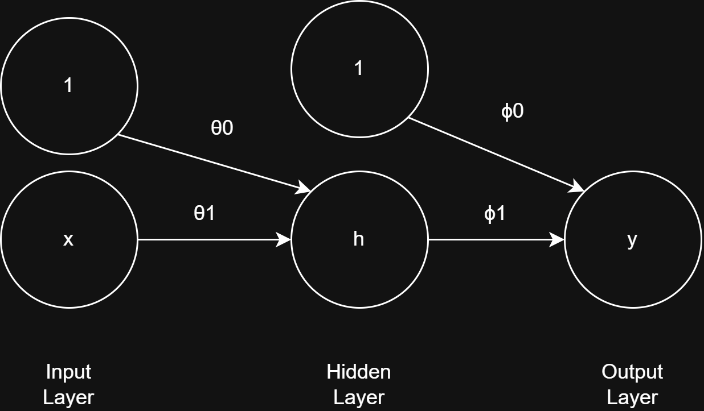
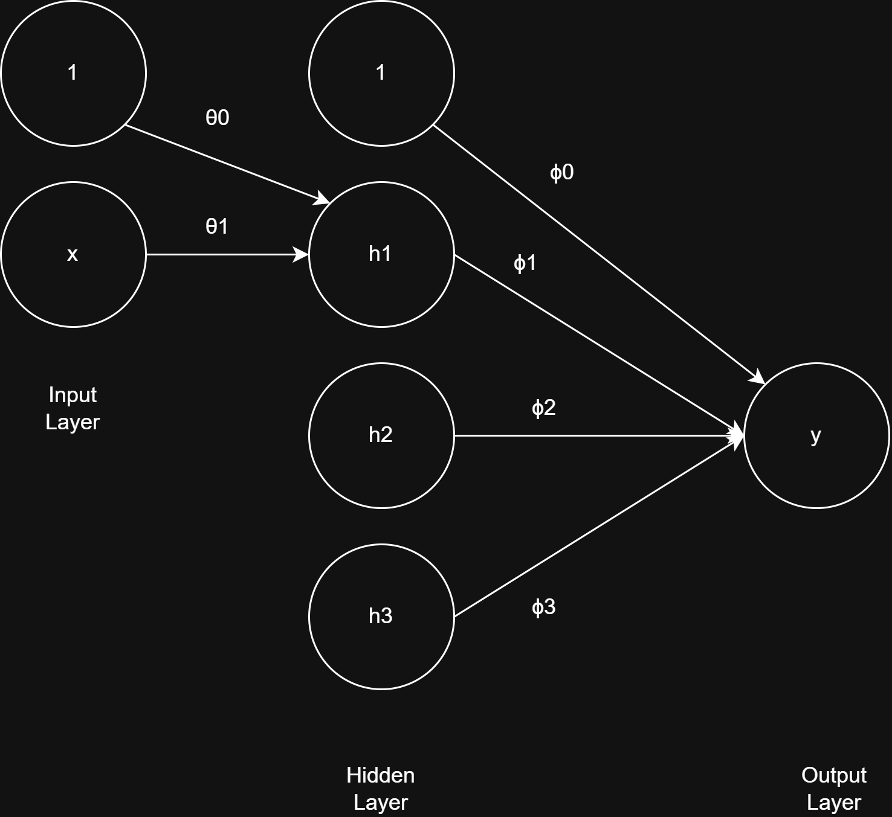

# Shallow Neural Networks

## Single Neuron Model

Since we know that the general supervised model is represented as:

$$y = f[x, \boldsymbol{\phi}]$$

where $\boldsymbol{\phi}$ is the set of all model parameters.

### Pre-activation and Output

For a model with 1 neuron in the hidden layer, the output equation is represented as:

$$y = \phi_0 + \phi_1 h$$

where $h$ is the activation of the hidden neuron, based on the linear pre-activation function:

$$z = \theta_0 + \theta_1 x$$

Since a linear combination of linear functions remains linear, we introduce non-linearity by applying an activation function $a[z]$ to $z$.

### Activation Function (ReLU)

We define the activation function using the Rectified Linear Unit (**ReLU**):

$$a[z] = \text{ReLU}[z] = \begin{cases} 0 & \text{if } z < 0 \\ z & \text{if } z \ge 0 \end{cases}$$

So $h = a[z] = \text{ReLU}[\theta_0 + \theta_1 x]$.

Substituting $h$ back into the output equation yields:

$$y = \phi_0 + \phi_1 a[\theta_0 + \theta_1 x]$$

---

## Shallow Neural Network (Multiple Hidden Neurons)

Expanding this to multiple neurons for a shallow neural network with a single hidden layer (e.g., 3 neurons):

The complete set of model parameters is:

$$\boldsymbol{\phi} = \{\phi_0, \phi_1, \phi_2, \phi_3, \theta_{10}, \theta_{11}, \theta_{20}, \theta_{21}, \theta_{30}, \theta_{31}\}$$

### Output Equation

The model output $y = f[x, \boldsymbol{\phi}]$ is:

$$y = f[x, \boldsymbol{\phi}] = \phi_0 + \phi_1 h_1 + \phi_2 h_2 + \phi_3 h_3$$

where each hidden neuron activation $h_j$ is given by:

$$h_1 = a[\theta_{10} + \theta_{11} x]$$
$$h_2 = a[\theta_{20} + \theta_{21} x]$$
$$h_3 = a[\theta_{30} + \theta_{31} x]$$

### Full Expanded Equation

Substituting $h_1, h_2, h_3$ into the output equation:

$$y = \phi_0 + \phi_1 a[\theta_{10} + \theta_{11} x] + \phi_2 a[\theta_{20} + \theta_{21} x] + \phi_3 a[\theta_{30} + \theta_{31} x]$$

