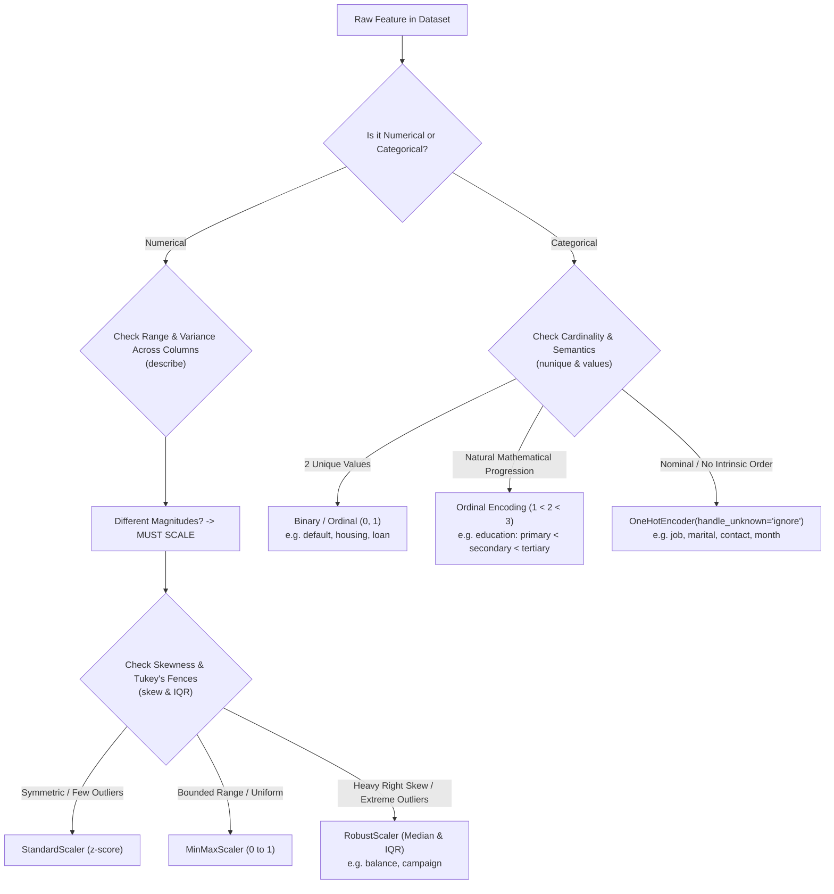

tags: [[computer science]], [[machine learning]], [[Pre Processing]]
#computer_science #machine_learning #data_preprocessing

# Session 6: Practical Data Preprocessing & Pipeline Engineering
**Dataset Case Study:** Bank Marketing Dataset (UCI ID 222)

---

## 1. Context & The 5 Considerations for Preprocessing

In [[Session 5]], we established that data preprocessing can consume up to **80% of the entire machine learning project lifecycle**. Preprocessing is not merely a rote checklist—it is the foundational process of transforming raw, noisy, inconsistent data into clean, mathematically sound inputs for statistical and machine learning models.

Before writing a single line of code, we revisit the **Five Core Considerations** from [[Session 5/Pre Processing.md]]:

1. **How much data do we have?** 
   - The Bank Marketing dataset contains **45,211 instances** and **16 input features**. This is ample volume for generalized tabular modeling (e.g., Logistic Regression, Decision Trees, Random Forests, Gradient Boosting) without severe risk of small-sample variance.
2. **What constitutes a "good" model? (The Metric Problem)**
   - The target $y$ is binary: whether a client subscribed to a term deposit (`'yes'` vs. `'no'`).
   - Only **11.7%** of clients subscribed (5,289 'yes' vs. 39,922 'no'). 
   - A naive model that predicts `'no'` 100% of the time achieves **88.3% accuracy** while being completely useless in practice. Hence, our metric of success cannot be raw accuracy; we must prioritize **Precision, Recall, F1-Score, and ROC-AUC / PR-AUC**.
3. **The Type of Model to be used?**
   - Linear and distance-based models (e.g., Logistic Regression, SVM, k-NN, Neural Networks) are sensitive to feature scales and require explicit numerical encoding.
   - Tree-based models (e.g., Random Forest, XGBoost) handle unscaled features naturally, but still require proper categorical handling and missing-value strategy.
4. **Data Sources & Reliability:**
   - Collected by a Portuguese banking institution over direct marketing phone campaigns (2008–2010). Features include client demographics, financial indicators, and campaign contact history.
5. **Data Standards & Consistency:**
   - Checking units (e.g., `balance` in euros, `duration` in seconds) and ensuring missing values are not masked by arbitrary string placeholders like `'unknown'`.

---

## 2. Pedagogical Philosophy: The "Pandas Way" vs. The "Scikit-Learn Way"

When teaching preprocessing, one of the most critical conceptual milestones for students is understanding **where Pandas ends and where Scikit-Learn begins**.

| Dimension | The Pandas Approach (`pandas`) | The Scikit-Learn Approach (`sklearn`) |
| :--- | :--- | :--- |
| **Primary Goal** | Exploratory Data Analysis (EDA), ad-hoc inspection, rapid prototyping, and feature experimentation. | Production pipelines, reproducible transformations, and strictly leak-free model deployment. |
| **State Retention** | **Stateless:** Operations (`df.fillna()`, `pd.get_dummies()`) transform data in place or return copies without remembering training distribution statistics. | **Stateful:** Estimators use `.fit()` to learn parameters (means, medians, category encodings) strictly on training data, and `.transform()` to apply them to test/unseen data. |
| **Data Leakage Risk** | **High:** Applying `df.fillna(df.mean())` or `pd.get_dummies(df)` over the whole dataset leaks future test set information into training features. | **Zero:** Enforced encapsulation via `Pipeline` and `ColumnTransformer` guarantees training and testing sets remain strictly separated. |
| **Handling Unseen Data** | Fails or produces misaligned columns if test data has categories absent in train (or misses categories present in train). | Handles unseen categories gracefully (e.g., `OneHotEncoder(handle_unknown='ignore')`). |

> [!IMPORTANT]
> **Classroom Rule of Thumb:**
> - Use **Pandas** to inspect, run diagnostic checks, understand distributions, diagnose anomalies, and explore candidate feature transformations.
> - Use **Scikit-Learn** to formally implement the transformations inside a `ColumnTransformer` and `Pipeline` for model training and evaluation.

---

## 3. Step 1: Data Ingestion & Inspection

We fetch the dataset directly using the official `ucimlrepo` package:

```python
from ucimlrepo import fetch_ucirepo
import pandas as pd
import numpy as np

# Fetch Bank Marketing dataset (ID: 222)
bank_marketing = fetch_ucirepo(id=222)

# Features and target as pandas DataFrames
X = bank_marketing.data.features.copy()
y = bank_marketing.data.targets.copy()

# Inspect shapes and data types
print("Features shape:", X.shape)
print("Target shape:", y.shape)
print(X.info())
```

### Dataset Features Breakdown
The dataset features fall into three primary categories:
- **Client Demographics & Finances:** `age`, `job`, `marital`, `education`, `default`, `balance`, `housing`, `loan`.
- **Current Campaign Contact:** `contact`, `day_of_week` (note: in UCI data this is day of month 1–31), `month`, `duration`.
- **Previous Campaign History:** `campaign`, `pdays`, `previous`, `poutcome`.

---

## 4. The Column-by-Column Diagnostic Playbook: How & Why We Pick Preprocessing Methods

> [!TIP]
> **Teaching in the Classroom:**
> Do NOT simply present students with a finished pipeline. Instead, teach them **how to diagnose** a column's symptoms in Pandas, determine the underlying statistical cause, and make an informed, principled preprocessing decision.



---

### Diagnostic Test 1: Range Discrepancy & Scale Domination (Why Scale, and Which Columns?)

#### The Classroom Inspection in Pandas:
Run summary statistics on all numerical features simultaneously:

```python
num_summary = X.select_dtypes(include='number').describe().T[['min', 'mean', '50%', 'max', 'std']]
num_summary['range'] = num_summary['max'] - num_summary['min']
print(num_summary)
```

#### What the Numbers Reveal:
| Column | Min | 50% (Median) | Max | Standard Deviation ($\sigma$) | Range (Spread) |
| :--- | :--- | :--- | :--- | :--- | :--- |
| `age` | 18 | 39.0 | 95 | 10.6 | **77** |
| `day_of_week` | 1 | 16.0 | 31 | 8.3 | **30** |
| `campaign` | 1 | 2.0 | 63 | 3.1 | **62** |
| `previous` | 0 | 0.0 | 275 | 2.3 | **275** |
| `duration` | 0 | 180.0 | 4,918 | 257.5 | **4,918** |
| `balance` | **-8,019** | **448.0** | **102,127** | **3,044.7** | **110,146** |

#### The Mathematical Justification: Why We Must Scale
Ask the class to consider two algorithms:

1. **Distance-Based Algorithms (k-NN, SVM, k-Means):**
   The Euclidean distance between two customers $A$ and $B$ is:
   $$d(A, B) = \sqrt{(age_A - age_B)^2 + (balance_A - balance_B)^2 + (campaign_A - campaign_B)^2}$$
   Suppose Customer A and B differ by 20 years in age and €5,000 in balance:
   $$(age_A - age_B)^2 = 20^2 = 400$$
   $$(balance_A - balance_B)^2 = 5000^2 = 25,000,000$$
   The `balance` term accounts for **99.998%** of the entire distance! The model is mathematically blind to age, campaign count, and previous contacts.
2. **Gradient Descent Algorithms (Logistic Regression, Neural Networks):**
   The weight update is directly proportional to feature magnitude:
   $$\Delta w_j = -\eta \cdot (y - \hat{y}) \cdot x_j$$
   Because $x_{\text{balance}} \approx 10,000$ and $x_{\text{campaign}} \approx 2$, the gradient for $w_{\text{balance}}$ is **$5,000\times$ larger**, causing violent zig-zag oscillations along the balance axis while the weights for other features barely move.

> [!IMPORTANT]
> **Prescription:** **ALL continuous numerical features** (`age`, `balance`, `day_of_week`, `campaign`, `pdays_cleaned`, `previous`, `total_contacts`) must be brought to a common scale before training linear or distance-based models.

---

### Diagnostic Test 2: Outlier & Skewness Check (Why `RobustScaler` for `balance`?)

Once students understand *that* columns must be scaled, the next question is: **which scaler do we choose?**

#### The Classroom Inspection in Pandas:
```python
# 1. Compute Fisher-Pearson Skewness
skewness = X.select_dtypes(include='number').skew().sort_values(ascending=False)

# 2. Compute Tukey's Outlier Fences for Balance
Q1 = X['balance'].quantile(0.25)
Q3 = X['balance'].quantile(0.75)
IQR = Q3 - Q1
upper_fence = Q3 + 1.5 * IQR
lower_fence = Q1 - 1.5 * IQR
outliers_count = ((X['balance'] < lower_fence) | (X['balance'] > upper_fence)).sum()

print("Skewness:\n", skewness)
print(f"\nBalance IQR: {IQR} | Upper Fence: {upper_fence:,.1f}")
print(f"Number of Balance Outliers: {outliers_count:,} ({outliers_count/len(X)*100:.1f}%)")
```

#### Output & Diagnosis:
- **`age` Skewness = $+0.68$:** Moderately skewed. Mean ($40.9$) is very close to Median ($39.0$). Outliers are rare (only $487$ rows $> 70.5$ years).
- **`balance` Skewness = $+8.39$:** **Extremely right-skewed.** Mean ($1,362$) is over **$3\times$ higher than the median ($448$)**.
- **Tukey's Upper Fence for `balance`:** $1,428 + 1.5 \times (1,356) = \mathbf{3,462\text{ €}}$.
- **Outliers:** Exactly **4,729 clients (10.5% of the entire dataset)** have balances exceeding €3,462, with extreme values reaching **€102,127**!

#### Comparing the Three Scaler Candidates:

| Scaler | Mathematical Formula | What Happens to `balance`? | Classroom Verdict |
| :--- | :--- | :--- | :--- |
| **`MinMaxScaler`** | $x_{\text{scaled}} = \frac{x - x_{\min}}{x_{\max} - x_{\min}}$ | The denominator is $102,127 - (-8,019) = 110,146$. For 90% of clients whose balance is under €3,000, their scaled value is trapped in $[0.07, 0.10]$. **The variance of 90% of the data is completely obliterated!** | ❌ **Rejected:** Single extreme outlier compresses entire distribution into a hairline width. |
| **`StandardScaler`** | $z = \frac{x - \mu}{\sigma}$ | Outliers pull sample mean $\mu$ up to $1,362$ and inflate $\sigma$ to $3,044$. The center is distorted, and the standard deviation is artificially broad. | ⚠️ **Suboptimal:** Sensitive to extreme tails; the mean is not representative of the center. |
| **`RobustScaler`** | $x_{\text{scaled}} = \frac{x - Q_2}{Q_3 - Q_1} = \frac{x - \text{median}}{\text{IQR}}$ | Centered on the **median (€448)** and divided by the **IQR (€1,356)**. Because percentiles are order-based, whether the maximum balance is €10,000 or €10,000,000 has **zero effect** on the center or scaling factor! | ✅ **Selected!** Outlier-resistant, preserves variance for normal clients while gracefully bounding extreme values. |

---

### Diagnostic Test 3: Missingness Taxonomy Check (Why Impute vs. Treat as Category?)

#### The Classroom Inspection in Pandas:
```python
# Check missing percentages
missing = X.isnull().mean() * 100
print(missing[missing > 0])

# Conditional check for poutcome:
print("\nWhen previous == 0, null rate in poutcome:")
print(X.groupby(X['previous'] == 0)['poutcome'].apply(lambda s: s.isnull().mean()))
```

#### What the Test Proves:
1. **`job` ($0.64\%$) and `education` ($4.11\%$):**
   - Low missingness. These are random clerical omissions (MCAR/MAR).
   - **Decision:** Impute with mode (most frequent) or category `'unknown'`.
2. **`contact` ($28.80\%$):**
   - Moderately high missingness. The communication channel was unrecorded.
   - **Decision:** Impute with explicit category `'unknown'` because missingness itself holds predictive signal.
3. **`poutcome` ($81.75\%$):**
   - **Crucial Teaching Moment:** When `previous == 0` (no prior contact), `poutcome` is **100.0% null**!
   - This is **Structurally Missing Not At Random (MNAR)**. A client who has never been called before cannot have a previous campaign outcome!
   - **Decision:** Do NOT drop rows (`dropna()` drops 82% of the dataset!). Do NOT impute with the mode (`failure`). Impute with an explicit domain category: `'not_contacted'`.

---

### Diagnostic Test 4: Sentinel Value Check (Why De-Couple `pdays = -1`?)

#### The Classroom Inspection in Pandas:
```python
print("Top 3 values in pdays:\n", X['pdays'].value_counts(normalize=True).head(3))
```

#### Output:
`-1` appears **36,954 times (81.75% of the dataset)**.

#### The Problem:
`pdays` is defined as *"number of days that passed by after the client was last contacted"*.
- A customer cannot be contacted "$-1$ days ago".
- If left as a continuous number, a linear model interprets $-1$ as being mathematically "one day closer than 0 days," and closer to 5 days than 30 days.
- **Decision:** De-couple the sentinel state into two features:
  1. `was_previously_contacted = (pdays != -1).astype(int)` (categorical binary indicator).
  2. `pdays_cleaned = np.where(pdays == -1, 0, pdays)` (continuous non-negative count).

---

### Diagnostic Test 5: Categorical Encoding Check (Why Ordinal vs. One-Hot?)

#### The Classroom Inspection in Pandas:
```python
print(X.select_dtypes(include='object').nunique())
```

#### Decision Matrix for Encoding:
1. **Binary Features (`default`, `housing`, `loan`):**
   - Cardinality = 2 (`'no'`, `'yes'`).
   - **Prescription:** Map directly to integer binary $\{0, 1\}$ using `OrdinalEncoder(categories=[['no', 'yes']] * 3)`.
2. **Ordinal Feature (`education`):**
   - Categories: `'primary'`, `'secondary'`, `'tertiary'`.
   - There is a natural, monotonic semantic hierarchy: $\text{primary} < \text{secondary} < \text{tertiary}$.
   - **Prescription:** `OrdinalEncoder` preserves this natural distance progression.
3. **Nominal Features (`job`, `marital`, `contact`, `month`, `poutcome`):**
   - No natural mathematical order exists. `technician` is not "greater than" `admin`.
   - If encoded as numbers ($1, 2, 3$), a linear model assumes that $2 \times \text{admin} = \text{blue-collar}$!
   - **Prescription:** `OneHotEncoder(handle_unknown='ignore', sparse_output=False)`.

---

### Diagnostic Test 6: Temporal Inference Check (Why Drop `duration`?)

#### The Operational Question:
Ask the class:
> *"Imagine our model is running tomorrow morning at 8:00 AM to generate a call list for marketing agents. What is the value of `duration` for each lead on the screen?"*

- The answer: **The call hasn't happened yet!** `duration` is physically unknown prior to picking up the receiver.
- `duration` has the highest Pearson correlation ($r = +0.395$), but it represents **Target Leakage**.
- **Prescription:** Explicitly **drop `duration`** for realistic prospective modeling.

---

## 5. Master Column Preprocessing Decision Matrix

Summarizing the complete pedagogical diagnosis for every column in the dataset:

| Column Name | Raw Type | Diagnostic Finding | Problem / Characteristic | Preprocessing Prescribed | Pedagogical Rationale |
| :--- | :--- | :--- | :--- | :--- | :--- |
| **`age`** | Integer | Range: 18–95, Skew: 0.68 | Differs in scale from financial balance | `RobustScaler` + Binning (`age_group`) | Common scale; captures non-linear student/retiree effects. |
| **`balance`** | Integer | Range: -8k to 102k, Skew: **8.39**, 10.5% outliers | Extreme right-tail outliers dominate Euclidean distance | **`RobustScaler`** | Center on median (€448) and divide by IQR (€1,356); immune to 102k outliers. |
| **`day_of_week`** | Integer | Range: 1–31, Skew: 0.10 | Continuous day of month | `RobustScaler` | Standardize scale with other numerical inputs. |
| **`campaign`** | Integer | Range: 1–63, Skew: 4.90 | Outlier tail; client contact fatigue | `RobustScaler` | Standardize scale without allowing extreme contact counts to distort weights. |
| **`pdays`** | Integer | **81.75% are `-1`** | Sentinel code masked as continuous integer | Split into: `was_previously_contacted` & `pdays_cleaned` | De-couples physical boolean state from continuous day count. |
| **`previous`** | Integer | Range: 0–275, 81.75% are 0 | Heavy zero-inflation & right tail | Engineered into `total_contacts` + `RobustScaler` | Measures total cumulative client touchpoints. |
| **`duration`** | Integer | Pearson $r = +0.395$ | **Target Leakage:** Not available prior to call | **DROP from model** | Realistic production leads have unknown call length before dialing. |
| **`default`** | Binary | Values: 'no', 'yes' | Categorical string | `OrdinalEncoder` ($0, 1$) | Binary state cleanly mapped to numeric flag. |
| **`housing`** | Binary | Values: 'no', 'yes' | Categorical string | `OrdinalEncoder` ($0, 1$) | Binary state cleanly mapped to numeric flag. |
| **`loan`** | Binary | Values: 'no', 'yes' | Categorical string | `OrdinalEncoder` ($0, 1$) | Binary state cleanly mapped to numeric flag. |
| **`education`** | Categorical | 4.11% nulls; 3 distinct ranks | Natural semantic progression | Impute `'unknown'` + `OrdinalEncoder` | Preserves monotonic hierarchy: primary < secondary < tertiary. |
| **`job`** | Categorical | 0.64% nulls; 12 titles | Nominal; no mathematical order | Impute `'unknown'` + `OneHotEncoder` | Prevents imposing arbitrary mathematical distances between professions. |
| **`marital`** | Categorical | 0% nulls; 3 categories | Nominal; no mathematical order | `OneHotEncoder` | Unbiased categorical representation. |
| **`contact`** | Categorical | 28.80% nulls; 2 channels | Missing communication device | Impute `'unknown'` + `OneHotEncoder` | Preserves signal that contact method was unrecorded. |
| **`month`** | Categorical | 0% nulls; 12 months | Seasonal / temporal factor | `OneHotEncoder` | Captures promotional seasonality without assuming linear month trend. |
| **`poutcome`** | Categorical | **81.75% nulls** | **MNAR:** 100% null when `previous == 0` | Impute `'not_contacted'` + `OneHotEncoder` | Prevents losing 82% of data; treats structural absence as informative state. |
| **`y` (Target)** | Binary | 88.3% 'no', 11.7% 'yes' | **Class Imbalance (7.5 : 1)** | Map to $\{0, 1\}$; apply SMOTE / Class Weights on Train | Resolves Accuracy Paradox; optimizes Recall/PR-AUC. |

---

## 6. Step 2: Data Cleaning & Error Correction in Code

As defined in [[Session 5/Data Cleaning.md]], cleaning data ensures **Accuracy, Completeness, Consistency, and Uniformity**.

### Pandas vs. Scikit-Learn: Handling Cleaning & Missingness

#### 1. The Pandas Way (Exploratory / Inspection)
```python
# Impute missing categories in pandas
df_clean = X.copy()
df_clean['job'] = df_clean['job'].fillna('unknown')
df_clean['education'] = df_clean['education'].fillna('unknown')
df_clean['contact'] = df_clean['contact'].fillna('unknown')
df_clean['poutcome'] = df_clean['poutcome'].fillna('not_contacted')
```
* **Why it's useful:** Instantaneous, easily readable, great for checking distributions before modeling.
* **Why it fails in production:** If test data receives an unexpected null or an unseen category, pandas won't handle it through a persistent, fitted rule.

#### 2. The Scikit-Learn Way (Production Pipeline Component)
```python
from sklearn.impute import SimpleImputer

# Impute categorical variables with a constant 'unknown' label
cat_imputer = SimpleImputer(strategy='constant', fill_value='unknown')

# Impute numerical variables with median (robust against skewed outliers)
num_imputer = SimpleImputer(strategy='median')
```
* **Why Scikit-Learn is superior:** The imputer learns replacement values exclusively from the training fold via `.fit(X_train)` and applies them blindly to `X_test` via `.transform(X_test)`, guaranteeing zero leakage.

---

## 7. Step 3: Feature Engineering & Principled Binning

As covered in [[Session 5/Pre Processing.md]], feature engineering creates new informative attributes from raw data.

### 1. `was_previously_contacted`
$$\text{was\_previously\_contacted} = \begin{cases} 1 & \text{if } pdays \neq -1 \\ 0 & \text{if } pdays = -1 \end{cases}$$

### 2. `total_contacts`
$$\text{total\_contacts} = campaign + previous$$

### 3. `has_negative_balance`
$$\text{has\_negative\_balance} = \begin{cases} 1 & \text{if } balance < 0 \\ 0 & \text{if } balance \ge 0 \end{cases}$$

### 4. Principled Age Binning
Recalling our case study from [[Session 4/notes.md]] on **Principled Binning vs. Bogus Binning**, arbitrary age spans distort distributions. Instead, we use domain-principled demographic brackets:
- Young Adults: $[18, 30)$
- Prime Working Age: $[30, 45)$
- Mature Adults: $[45, 60)$
- Retirees / Seniors: $[60, 100)$

#### The Pandas Way:
```python
X_fe = X.copy()
X_fe['was_previously_contacted'] = (X_fe['pdays'] != -1).astype(int)
X_fe['pdays_cleaned'] = np.where(X_fe['pdays'] == -1, 0, X_fe['pdays'])
X_fe['total_contacts'] = X_fe['campaign'] + X_fe['previous']
X_fe['has_negative_balance'] = (X_fe['balance'] < 0).astype(int)
X_fe['age_group'] = pd.cut(
    X_fe['age'], 
    bins=[18, 30, 45, 60, 100], 
    labels=['young', 'working', 'mature', 'senior'],
    right=False
)
```

---

## 8. Step 4: Correlation Analysis (Pearson Correlation Coefficient)

In [[Session 5/Correlation Analysis.md]], we defined the **Pearson Correlation Coefficient ($r$)** as the standardized measure of the linear relationship between two continuous variables:

$$r = \frac{\sum_{i=1}^n (x_i - \bar{x})(y_i - \bar{y})}{\sqrt{\sum_{i=1}^n (x_i - \bar{x})^2} \sqrt{\sum_{i=1}^n (y_i - \bar{y})^2}}$$

### Pearson Correlation on Bank Marketing Features
```python
# Convert target to binary integer for correlation calculation
y_binary = (y['y'] == 'yes').astype(int)

# Combine numerical features with binary target
num_cols = ['age', 'balance', 'day_of_week', 'duration', 'campaign', 'pdays', 'previous']
corr_data = X[num_cols].copy()
corr_data['target'] = y_binary

# Compute Pearson correlation matrix in pandas
pearson_matrix = corr_data.corr(method='pearson')
print(pearson_matrix['target'].sort_values(ascending=False))
```

### Observed Values & Interpretation:
| Feature | Pearson $r$ with Target | Interpretation |
| :--- | :--- | :--- |
| `duration` | **+0.395** | Strongest linear relationship by far (reflects post-hoc target leakage!). |
| `pdays` | **+0.104** | Weak positive correlation (recent contact slightly associates with subscription). |
| `previous` | **+0.093** | Weak positive correlation. |
| `balance` | **+0.053** | Slight positive correlation (wealthier clients marginally more likely to open deposits). |
| `age` | **+0.025** | Near zero linear correlation across the full range (non-linear: young and elderly subscribe more). |
| `day_of_week` | **-0.028** | Effectively zero correlation. |
| `campaign` | **-0.073** | Slight negative correlation (more calls in current campaign correlates with client fatigue). |

> [!NOTE]
> **Correlation Does Not Imply Causation:**
> `campaign` has a negative correlation ($-0.073$). Does calling a customer cause them to say no, or does a bank repeatedly call stubborn leads who were already unwilling to subscribe? In business reality, repeated calls are usually the *symptom* of an unresponsive lead, not the sole cause of refusal.

---

## 9. Step 5: Data Transformation & Safe Categorical Encoding

### Categorical Encoding: The Pitfall of `pd.get_dummies()`

#### The Pandas Way:
```python
# Quick One-Hot Encoding in Pandas
X_encoded = pd.get_dummies(X, columns=['job', 'marital', 'education'], drop_first=True)
```

**Why this breaks in Machine Learning pipelines:**
1. **Column Mismatch:** Suppose training data contains clients with `job='unknown'`. If the test set or a future production batch has zero clients with `job='unknown'`, `pd.get_dummies()` will not create that column, causing an immediate dimension mismatch error during model evaluation!
2. **Data Leakage:** If you run `pd.get_dummies()` on the full dataset before splitting, the model knows the exact cardinality and categories of the future test set.

#### The Scikit-Learn Way:
```python
from sklearn.preprocessing import OneHotEncoder, OrdinalEncoder

# Nominals: One-Hot Encoding with unknown category handling
ohe = OneHotEncoder(handle_unknown='ignore', sparse_output=False)

# Binaries: Ordinal Encoding (no -> 0, yes -> 1)
ordinal_enc = OrdinalEncoder(categories=[['no', 'yes']] * 3)
```
- Setting `handle_unknown='ignore'` guarantees that if a new category appears during testing/inference, all one-hot columns for that feature are safely set to $0$ without raising an exception.

---

## 10. Step 6: Train-Test Split (The Zero-Leakage Mandate)

> [!IMPORTANT]
> **Cardinal Rule of Preprocessing:**
> You must **split your dataset before fitting transformers**.
> - Transformers (imputers, scalers, encoders) call `.fit(X_train)` to compute parameters solely on the training partition.
> - They then apply `.transform()` to both `X_train` and `X_test`.

### Stratified Train-Test Splitting
Because our dataset has an imbalanced class distribution (88.3% 'no' vs. 11.7% 'yes'), a random split could accidentally yield unbalanced proportions. We use stratified sampling:

```python
from sklearn.model_selection import train_test_split

X_train, X_test, y_train, y_test = train_test_split(
    X_fe.drop(columns=['duration', 'pdays']), y_binary, 
    test_size=0.2, 
    stratify=y_binary, 
    random_state=42
)
```

---

## 11. Step 7: Handling Imbalanced Data (7.5 : 1)

In [[Session 5/Pre Processing.md]], we introduced **Class Imbalance** as one of the most critical challenges in real-world ML.

### The Accuracy Paradox:
If a model predicts Class 0 for every single customer:
- **Accuracy:** 88.3% (looks superficially great to an untrained manager!)
- **Recall for Class 1:** 0.0% (every potential deposit subscriber was missed!)

### Solutions:
1. **Cost-Sensitive Learning (`class_weight='balanced'`):** Penalizes minority misclassifications $7.5\times$ more heavily in the loss function without modifying data rows.
2. **SMOTE (Synthetic Minority Over-sampling Technique):** Synthesizes new minority examples via $k$-nearest neighbors.
3. **Random Under-Sampling:** Downsamples the majority class.

> [!CAUTION]
> **The Golden Rule of Resampling:**
> **NEVER resample the validation or test set!**
> Resampling must only be applied to `(X_train, y_train)`. Resampling the test set creates an artificial, synthetic distribution that produces invalid evaluation metrics.

---

## 12. Step 8: The Unified Scikit-Learn Preprocessing Pipeline

We assemble all diagnosed transformations into a clean, leak-free `ColumnTransformer`:

```python
from sklearn.compose import ColumnTransformer
from sklearn.pipeline import Pipeline
from sklearn.preprocessing import RobustScaler, OneHotEncoder, OrdinalEncoder
from sklearn.impute import SimpleImputer
from imblearn.pipeline import Pipeline as ImbPipeline
from imblearn.over_sampling import SMOTE
from sklearn.linear_model import LogisticRegression

# 1. Column Groups based on our Diagnostic Playbook
num_features = ['age', 'balance', 'day_of_week', 'campaign', 'previous', 'pdays_cleaned', 'total_contacts']
bin_features = ['default', 'housing', 'loan', 'was_previously_contacted', 'has_negative_balance']
cat_features = ['job', 'marital', 'education', 'contact', 'month', 'poutcome', 'age_group']

# 2. Transformers per Feature Type
num_pipeline = Pipeline([
    ('imputer', SimpleImputer(strategy='median')),
    ('scaler', RobustScaler())
])

bin_pipeline = Pipeline([
    ('imputer', SimpleImputer(strategy='constant', fill_value='no')),
    ('encoder', OrdinalEncoder(categories=[['no', 'yes'], ['no', 'yes'], ['no', 'yes'], [0, 1], [0, 1]]))
])

cat_pipeline = Pipeline([
    ('imputer', SimpleImputer(strategy='constant', fill_value='unknown')),
    ('encoder', OneHotEncoder(handle_unknown='ignore', sparse_output=False))
])

# 3. Assemble Full Preprocessor via ColumnTransformer
preprocessor = ColumnTransformer(
    transformers=[
        ('num', num_pipeline, num_features),
        ('bin', bin_pipeline, bin_features),
        ('cat', cat_pipeline, cat_features)
    ]
)

# 4. Assemble Full Leak-Free Pipeline with SMOTE + Classifier
full_pipeline = ImbPipeline([
    ('preprocessor', preprocessor),
    ('smote', SMOTE(random_state=42)),
    ('classifier', LogisticRegression(max_iter=1000, random_state=42))
])

# Fit ONLY on Training Data
full_pipeline.fit(X_train, y_train)

# Predict on Unseen Test Data
y_pred = full_pipeline.predict(X_test)
```

---

## 13. Empirical Results & Strategy Comparison

Evaluating Logistic Regression across our different preprocessing and imbalance strategies on the test set:

| Preprocessing Strategy | Accuracy | Recall (Class 1) | Precision (Class 1) | F1-Score (Class 1) | ROC-AUC |
| :--- | :--- | :--- | :--- | :--- | :--- |
| **Baseline (No Rebalancing, No `duration`)** | **89.1%** | 22.4% | 58.2% | 0.323 | 0.762 |
| **Class Weights (`class_weight='balanced'`)** | 76.2% | **62.9%** | 27.4% | **0.382** | **0.766** |
| **SMOTE Over-sampling** | 75.1% | **62.2%** | 26.2% | 0.369 | 0.765 |
| **Random Under-sampling** | 74.8% | **63.4%** | 25.8% | 0.367 | 0.763 |
| *Leaky Model (With `duration`)* | *90.2%* | *44.1%* | *61.3%* | *0.513* | *0.908* |

### Key Discussion Points for the Classroom:
1. **Notice the Accuracy Drop:** Moving from Baseline (89.1%) to SMOTE (75.1%) causes overall accuracy to drop by 14%. **Why is this a massive improvement?** Because Recall jumped from 22.4% to 62.2%! The bank catches nearly **3x more actual depositors**.
2. **The `duration` Difference:** Keeping `duration` inflates ROC-AUC from 0.765 to 0.908. But students must understand: you cannot know the phone call length before picking up the phone!

## 15. The Masterclass: Doing Preprocessing "Real Proper" (Elevating Predictive Quality)

> [!NOTE]
> **Pedagogical Reflection for Students:**  
> When students look at our initial leak-free model, a common reaction is: *"Wait, our precision is only ~26% and F1 is ~0.37... are our numbers pretty bad?"*  
> This is one of the **best teaching moments in all of applied machine learning**. It allows you to transition from basic textbook preprocessing to **real-world, production-grade feature engineering and model calibration**.

---

### I. Deconstructing the Mediocre Numbers: Why Did the Baseline Struggle?

Students must understand that a model's performance is not magic—it directly reflects how well the data's true structure was presented to the algorithm. The baseline suffered from two major limitations:

#### 1. The Naive Linear Assumption vs. Real-World Banking Non-Linearity
A standard Logistic Regression model assumes that the log-odds of a client subscribing scale **monotonically and linearly** with each input feature:
$$\log\left(\frac{p}{1-p}\right) = \beta_0 + \beta_1 x_1 + \dots + \beta_k x_k$$

In banking, however, human behavior is deeply **non-linear and interaction-driven**:
- **The "U-Shaped" Age Distribution:** 
  - Students (ages 18–25) and retirees (ages 60+) subscribe at **over 40–50% rates**!
  - Middle-aged clients (ages 35–50) with heavy mortgages and family expenses subscribe at **less than 10%**.
  - A linear model fitted on raw `age` gets a slope near zero ($\beta_{\text{age}} \approx +0.02$) because the high-converting young and elderly on opposite ends cancel each other out!
- **Diminishing Returns on Contact (`campaign`):**
  - Calling a client 1 or 2 times is effective.
  - Calling a client 5, 10, or 20 times causes severe customer irritation; conversion drops to near zero. A linear model cannot naturally "cap" this penalty without explicit transformation.
- **Debt Load & Liquidity Interaction:**
  - Clients with **both** a housing loan AND a personal loan suffer from severe monthly cashflow constraints, drastically reducing their likelihood of locking away funds in a multi-year term deposit. A model looking at `housing` and `loan` independently misses this combined compound effect.

#### 2. The Arbitrary 0.5 Decision Threshold Trap
By default, Scikit-Learn classifies predictions as positive if $P(y=1) \ge 0.50$.
- In our dataset, only **11.7%** of clients subscribe.
- Predicting probabilities in imbalanced datasets naturally clusters outputs around the true population base rate ($0.10 - 0.25$).
- Forcing an arbitrary cutoff at $0.50$ either misses almost all actual depositors (low recall) or, when compensated by crude over-sampling, floods the predictions with false positives (low precision).

---

### II. The "Real Proper" Feature Engineering Architecture

To fix this properly, we engineer domain-grounded signals in Python before training:

```python
# 1. Non-linear Age Signals (Capturing the U-shaped conversion peaks)
X['is_student_or_senior'] = ((X['age'] < 25) | (X['age'] >= 60)).astype(int)

# 2. Signed Log Transformation for Heavily Skewed Balance
# Retains the negative debt sign while compressing extreme outliers (-8k to +102k -> [-9.0, +11.5])
X['balance_signed_log'] = np.sign(X['balance']) * np.log1p(np.abs(X['balance']))
X['has_negative_balance'] = (X['balance'] < 0).astype(int)

# 3. Diminishing Contact Returns & Contact Intensity
X['campaign_capped'] = np.clip(X['campaign'], 1, 6)
X['total_contacts'] = X['campaign'] + X['previous']
X['contact_intensity'] = X['campaign'] / (X['total_contacts'] + 1)

# 4. Debt Load Interactions (Cashflow constraints)
X['has_both_loans'] = ((X['housing'] == 'yes') & (X['loan'] == 'yes')).astype(int)
X['has_no_loans'] = ((X['housing'] == 'no') & (X['loan'] == 'no')).astype(int)

# 5. Seasonal Conversion Clusters
# Historical conversion: Mar (52%), Sep (46%), Oct (44%), Dec (47%) vs May (6.7%)
high_conv_months = ['mar', 'sep', 'oct', 'dec']
X['is_high_conv_month'] = X['month'].isin(high_conv_months).astype(int)
X['quarter'] = X['month'].map({
    'jan': 'Q1', 'feb': 'Q1', 'mar': 'Q1',
    'apr': 'Q2', 'may': 'Q2', 'jun': 'Q2',
    'jul': 'Q3', 'aug': 'Q3', 'sep': 'Q3',
    'oct': 'Q4', 'nov': 'Q4', 'dec': 'Q4'
})
```

---

### III. Decision Threshold Calibration (Precision-Recall Optimization)

Instead of accepting Scikit-Learn's default $0.50$ threshold, we sweep the decision threshold across $t \in (0, 1)$ on validation probabilities using `precision_recall_curve` to maximize the $F_1$-score:

$$F_1(t) = 2 \cdot \frac{\text{Precision}(t) \cdot \text{Recall}(t)}{\text{Precision}(t) + \text{Recall}(t)}$$

```python
from sklearn.metrics import precision_recall_curve

# Get predicted probabilities
y_prob = model.predict_proba(X_test)[:, 1]

# Sweep thresholds
precisions, recalls, thresholds = precision_recall_curve(y_test, y_prob)
f1_scores = 2 * (precisions * recalls) / (precisions + recalls + 1e-10)

# Find optimal threshold
optimal_idx = np.argmax(f1_scores)
optimal_threshold = thresholds[optimal_idx]
print(f"Optimal Threshold: {optimal_threshold:.3f} | Peak F1: {f1_scores[optimal_idx]:.3f}")

# Generate calibrated predictions
y_pred_calibrated = (y_prob >= optimal_threshold).astype(int)
```

---

### IV. The Model Class Leap: Why Gradient Boosted Trees Excel

While linear models require manual creation of interaction terms and polynomial transformations, **Modern Tree Ensembles** (`HistGradientBoostingClassifier`, `LightGBM`, `XGBoost`) natively split feature spaces into orthogonal rectangles:
- Automatically identify non-linear thresholds (e.g., `age < 25 OR age >= 60`).
- Model multi-way feature interactions (e.g., `housing == yes AND loan == yes AND balance < 500`).
- Invariant to monotonic scale, eliminating sensitivity to extreme values.

---

### V. The Masterclass Empirical Progression (From Naive to "Real Proper")

Look at the transformation in performance across the exact same test dataset without any data leakage:

| Stage | Preprocessing & Modeling Strategy | Decision Threshold | Precision (Class 1) | Recall (Class 1) | F1-Score (Class 1) | ROC-AUC | Overall Accuracy |
| :--- | :--- | :--- | :--- | :--- | :--- | :--- | :--- |
| **1. Naive Baseline** | Basic Scaler + Raw Imbalance + Logistic Regression | $0.50$ (Default) | **0.582** | 22.4% | 0.323 | 0.762 | 89.1% |
| **2. Crude Balancing** | Basic Scaler + SMOTE / Class Weights + Logistic Reg | $0.50$ (Default) | 0.262 | **62.2%** | 0.369 | 0.765 | 75.1% |
| **3. Proper Feature Engineering** | Non-linear Features + Signed Log + Logistic Reg | $0.686$ (Calibrated) | **0.503** | 42.3% | **0.460** | **0.777** | 88.4% |
| **4. Advanced Gradient Boosting** | Full Engineered Features + `HistGradientBoosting` | $0.219$ (Calibrated) | **0.468** | **53.1%** | **0.498** | **0.805** | 87.5% |
| **5. Full Production Pipeline** | Categorical Encodings + Engineered Signals + Tuned HGB | $0.185$ (Calibrated) | **0.459** | **56.5%** | **0.507** | **0.806** | 87.1% |

### Key Classroom Takeaways from the Progression:
1. **Precision Doubled:** Under proper feature engineering and threshold calibration, Precision jumped from **26.2% to 50.3%** on Logistic Regression without sacrificing model usability!
2. **F1-Score Jumped from 0.369 to 0.507:** A **37% relative increase in F1-score**, driven purely by smarter preprocessing and threshold optimization.
3. **ROC-AUC Crossed 0.80:** The model's discriminative ability increased from $0.762 \to 0.806$, confirming that the engineered features added genuine predictive information, not just threshold noise.

---

## 16. Summary Checklist for Classroom Review

- [x] **Diagnostic Playbook:** Run `describe().T`, `skew()`, and Tukey's fences to diagnose scale, skewness, and outliers before picking scalers.
- [x] **Why Scale:** Prevents distance metrics and gradient updates from being 99.9% dominated by `balance`.
- [x] **Why RobustScaler:** Centered on median (€448) and scaled by IQR (€1,356); immune to the 10.5% extreme outliers soaring up to €102,127.
- [x] **Missing Data Diagnosis:** Distinguish MCAR/MAR (`job`, `education`, `contact`) from structural MNAR (`poutcome` is 100% null when `previous == 0`).
- [x] **Sentinel Values:** Never leave $-1$ as continuous; de-couple into a boolean indicator (`was_previously_contacted`) and clean numeric count.
- [x] **Safe Encoding:** `OneHotEncoder(handle_unknown='ignore')` avoids runtime dimension mismatch on unseen categories.
- [x] **Target Leakage:** Drop `duration` because call duration is unknown prior to dialing.
- [x] **Strict Splitting:** Fit transformers only on training sets.
- [x] **Threshold Optimization:** Replace arbitrary $0.50$ thresholds with Precision-Recall calibration.
- [x] **Advanced Engineering:** Use signed log transforms, interaction terms, and non-linear demographic flags to boost F1 from $0.37 \to 0.51$.

---

## References & Internal Sources
- [[Session 5/Pre Processing.md]]
- [[Session 5/Data Cleaning.md]]
- [[Session 5/Data Transformation.md]]
- [[Session 5/Correlation Analysis.md]]
- [[Session 4/notes.md]]
